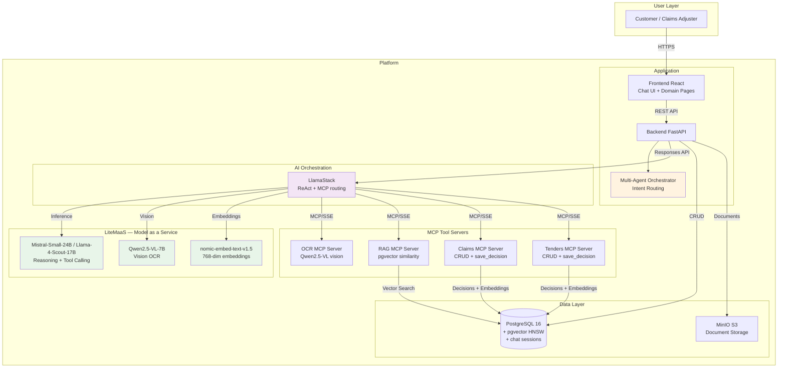

# Agentic Multi-Domain Decision Platform

An intelligent multi-agent decision platform powered by AI agents, demonstrating autonomous decision-making through **ReAct (Reasoning + Acting)** workflows with built-in compliance guardrails. The platform supports **multiple business domains** with a shared agent infrastructure and a **multi-agent orchestrator** that dynamically routes user requests to specialized domain agents:

- **Insurance Claims Processing** — Approve / Deny / Manual Review decisions
- **Tender Management (Appels d'Offres)** — Go / No-Go / Needs Deeper Review decisions for construction (BTP) tenders
- **Multi-Agent Orchestrator** — Intent-based routing, chat sessions, and cross-domain agent chaining

## Table of Contents

- [Business Overview](#business-overview)
- [Architecture](#architecture)
- [Technology Stack](#technology-stack)
- [Local Development](#local-development)
- [OpenShift Deployment](#openshift-deployment)
- [Configuration](#configuration)
- [Troubleshooting](#troubleshooting)
- [Known Issues](#known-issues)

---

## Business Overview

### What Problem Does This Solve?

Many business processes require expert analysis of documents, comparison with historical data, and structured decision-making — tasks that are time-consuming and prone to inconsistencies. This platform showcases how AI agents can **autonomously** process these tasks through intelligent reasoning and tool usage, while maintaining human oversight where needed.

### Use Case 1: Insurance Claims Processing

- Autonomous document processing via vision-based OCR (Qwen2.5-VL)
- Smart policy matching via semantic search through user contracts
- Precedent-based reasoning using similar historical claims (RAG)
- Decision: **Approve / Deny / Manual Review** with confidence score

### Use Case 2: Tender Management (Appels d'Offres)

- Ingests tender documents (DCE/RFP) and extracts key information via OCR
- Analyzes the tender against the company's past project references, certifications, and historical tender outcomes using RAG similarity search
- Generates a **Go / No-Go / Needs Deeper Review** recommendation with risk analysis, win probability, estimated margin, strengths and weaknesses
- Supports Human-in-the-Loop review when confidence is low

### The ReAct Agentic Workflow

Instead of rigid, pre-programmed rules, the system uses the **ReAct (Reasoning + Acting)** pattern where an AI agent reasons about what information it needs, calls appropriate tools, observes the results, and repeats until it can make a decision.

In practice, the agent calls **all 4 tools in a single parallel batch** for maximum efficiency:

```
Customer Submits Claim
        |
+-------------------------------------------------------+
|  ReAct Agent — Single-batch parallel tool calling      |
+-------------------------------------------------------+
|                                                        |
|  get_claim(claim_id)          -> Claim details         |
|  ocr_document(document_id)   -> Extracted text (OCR)   |
|  retrieve_user_info(user_id) -> Contracts & coverage   |
|  retrieve_similar_claims()   -> Historical precedents  |
|                                                        |
|  All 4 tools accept the claim number directly.         |
|  Auto-resolution removes inter-tool dependencies.      |
+-------------------------------------------------------+
        |
  Agent synthesizes all results
  -> Recommendation: Approve / Deny / Manual Review
  -> Confidence score + reasoning
        |
  save_claim_decision() -> Persists decision + embedding
```

### Multi-Agent Orchestrator

The platform includes a **multi-agent orchestrator** that classifies user intent via LLM and dispatches requests to the appropriate specialized agent:

```
User Message
    |
    v
+------------------------------+
|   Multi-Agent Orchestrator   |
|   (Intent Classification)    |
+------------------------------+
    |              |
    v              v
+---------+  +-----------+
| Claims  |  | Tenders   |
| Agent   |  | Agent     |
+---------+  +-----------+
    |              |
    v              v
+------------------------------+
|     MCP Tool Servers         |
| OCR | RAG | Claims | Tenders |
+------------------------------+
    |
    v
+------------------------------+
|   S3/MinIO + PostgreSQL      |
|   Documents + Decisions      |
+------------------------------+
```

**Key capabilities**:
- **SSE Streaming**: Real-time response streaming via `POST /chat/stream` with tool call events, text deltas, and completion notifications
- **Decision persistence**: Agents call `save_claim_decision` / `save_tender_decision` MCP tools to persist decisions, update status, and auto-generate embeddings
- **RAG by precedents**: Similar claims/tenders found via pgvector cosine similarity on OCR text embeddings
- **Intent-based routing**: Keyword classification routes user messages to the correct domain agent
- **Chat sessions**: Persistent conversation history with session management
- **Tool call observability**: Full tool execution traces (name, server, output, error) persisted and displayed in UI
- **Token consumption tracking**: Per-message and per-session LLM token usage displayed in chat
- **Bilingual support**: FR/EN language detection and response generation

### Compliance & Guardrails

#### PII Detection & Protection

- Automatic detection of emails, phone numbers, dates of birth, license plates during processing
- Real-time flagging without blocking workflow
- Complete audit trail for GDPR/CCPA compliance

#### Human-in-the-Loop (HITL) Review

For claims/tenders requiring manual review (low confidence, high-value, edge cases):
1. System shows AI recommendation with reasoning
2. Reviewer can ask clarifying questions to the agent
3. Reviewer makes final decision (approve/deny/request info)
4. System tracks both AI and human decisions for audit

---

## Architecture

### System Overview



### Services Architecture

```
backend/
├── app/
│   ├── api/                  # Thin HTTP layer (routing, validation, schemas)
│   │   ├── claims.py         # Claims REST endpoints
│   │   ├── tenders.py        # Tenders REST endpoints
│   │   ├── orchestrator.py   # Multi-agent chat/orchestrator endpoints
│   │   ├── hitl.py           # Human-in-the-Loop review endpoints
│   │   └── admin.py          # Admin panel (database reset, stats)
│   ├── services/
│   │   ├── claim_service.py              # Claims orchestration
│   │   ├── tender_service.py             # Tenders orchestration
│   │   ├── agents/                       # Multi-agent layer
│   │   │   ├── base_agent_service.py     # Common agent pattern
│   │   │   ├── orchestrator_service.py   # Intent routing & chat sessions
│   │   │   └── registry.py              # Dynamic agent registry
│   │   ├── agent/                        # Shared AI components
│   │   │   ├── responses_orchestrator.py # LlamaStack Responses API client
│   │   │   └── response_parser.py        # Extract structured decisions
│   │   └── pii/                          # PII detection & redaction
│   ├── models/               # Database ORM (claims, tenders, conversations)
│   └── llamastack/           # Prompts & integration config
│       ├── prompts.py              # Claims agent prompts
│       ├── ao_prompts.py           # Tender agent prompts
│       └── orchestrator_prompts.py # Multi-agent router prompts
├── mcp_servers/
│   ├── shared/               # Shared DB module (connection, retry, queries)
│   ├── ocr_server/           # Document OCR via Qwen2.5-VL vision model
│   ├── rag_server/           # Vector search (pgvector) + embedding generation
│   ├── claims_server/        # Claims CRUD + save_claim_decision + auto-embedding
│   └── tenders_server/       # Tenders CRUD + save_tender_decision + auto-embedding
├── scripts/
│   ├── init_data.py          # Data initialization (PDFs, upload, OCR, decisions)
│   └── init_data/            # PDF generator + pre-defined decisions
frontend/
├── src/
│   ├── pages/
│   │   ├── HomePage.tsx          # Dashboard with agent cards
│   │   ├── ChatPage.tsx          # Multi-agent chat interface
│   │   ├── ClaimsListPage.tsx    # Claims list with filters & search
│   │   ├── ClaimDetailPage.tsx   # Claim detail with processing steps
│   │   ├── TendersListPage.tsx   # Tenders list & filtering
│   │   └── TenderDetailPage.tsx  # Tender detail with processing steps
│   ├── components/
│   │   ├── chat/                 # Chat UI (messages, tool calls, tokens)
│   │   └── claim/                # ClaimHeader, ProcessingSteps, StepOutputDisplay
│   ├── hooks/
│   │   └── useChat.ts            # Chat session management + SSE streaming
│   └── i18n/                     # Internationalization FR/EN
```

---

## Technology Stack

| Component | Technology | Details |
|-----------|-----------|---------|
| **LLM Inference** | LiteMaaS (Model as a Service) | Mistral-Small-24B (default) / Llama-4-Scout-17B (backup) |
| **Vision OCR** | Qwen2.5-VL-7B via LiteMaaS | PDF page images -> structured text extraction |
| **Embeddings** | nomic-embed-text-v1.5 via LiteMaaS | 768-dim vectors for similarity search |
| **AI Orchestration** | LlamaStack (Red Hat) | ReAct agent, MCP tool routing, Responses API |
| **Backend** | Python 3.12 + FastAPI | REST API + SSE streaming |
| **Frontend** | React 18 + TypeScript + Tailwind | Chat UI + domain pages |
| **Database** | PostgreSQL 16 + pgvector (HNSW) | Claims, tenders, vectors, chat sessions |
| **Document Storage** | MinIO S3-compatible | PDF documents for claims & tenders |
| **MCP Servers** | FastMCP + SSE transport | OCR, RAG, Claims CRUD, Tenders CRUD |
| **Deployment** | Helm 3.x on OpenShift 4.x | Or docker/podman compose for local dev |

**Key architectural choice**: All AI models run as **remote Model-as-a-Service (MaaS)** through LiteMaaS endpoints. No local GPU required. The OCR server sends PDF page images to Qwen2.5-VL via the LlamaStack inference API, eliminating the need for heavy local OCR libraries.

---

## Local Development

### Quick Start with Docker/Podman Compose

```bash
# 1. Set your LiteMaaS credentials (required)
export LITEMAAS_URL=https://your-litemaas-llm-endpoint/v1
export LITEMAAS_API_KEY=sk-your-key
export LITEMAAS_EMBEDDING_URL=https://your-litemaas-embedding-endpoint/v1
export LITEMAAS_EMBEDDING_API_KEY=sk-your-key

# 2. Start all services
podman compose up --build

# Or with docker
docker compose up --build
```

### What Gets Started

| Service | Port | Description |
|---------|------|-------------|
| PostgreSQL + pgvector | 5433 | Database with schema + seed data (30 claims, 30 tenders) |
| LlamaStack | 8321 | AI orchestration (ReAct agent, MCP tool routing) |
| Backend (FastAPI) | 8000 | REST API + SSE streaming + orchestrator |
| OCR MCP Server | 8081 | Vision-based OCR via Qwen2.5-VL |
| RAG MCP Server | 8082 | Vector search + embedding generation |
| Claims MCP Server | 8083 | Claims CRUD + decision persistence + auto-embedding |
| Tenders MCP Server | 8084 | Tenders CRUD + decision persistence + auto-embedding |
| MinIO | 9000/9001 | S3-compatible document storage |
| Frontend (React) | 3000 | Chat UI + domain pages |
| **data-init** | — | Generates PDFs, uploads to LlamaStack, processes 10+10 items |

### Automatic Data Initialization

On first startup, the `data-init` service automatically:

1. **Generates 60 realistic PDF documents** (30 claims + 30 tenders) using reportlab
2. **Uploads PDFs to LlamaStack Files API** and updates `document_path` in database
3. **Processes 10 claims** via MCP tools: OCR (Qwen2.5-VL) + save_claim_decision (with embedding)
4. **Processes 10 tenders** via MCP tools: OCR + save_tender_decision (with embedding)

After init completes (~3-5 min), you'll have:
- 30 claims: 20 pending, 4 approved, 3 denied, 3 manual_review (with processing steps, OCR text, embeddings)
- 30 tenders: 20 pending, 4 go, 3 no_go, 3 needs_deeper_review

The init is **idempotent** — it checks if data already exists before running.

### Access

- **Frontend**: http://localhost:3000
- **Backend API**: http://localhost:8000/api/v1
- **MinIO Console**: http://localhost:9001

### Development Notes

- `docker-compose.yml` is the git-tracked version with placeholder values
- Set LiteMaaS credentials via environment variables or a `.env` file
- Backend has hot-reload enabled (app code mounted as volume)
- Frontend has hot-reload via Vite dev server
- MCP servers require a rebuild to pick up code changes: `podman compose up --build <service>`

### Resetting Data

```bash
# Remove volumes and restart
podman compose down -v
podman compose up --build
```

---

## OpenShift Deployment

### Prerequisites

1. **OpenShift 4.x** with Helm 3.12+
2. **LiteMaaS endpoints** for LLM inference, vision OCR, and embeddings (no local GPU needed)
3. **Container registry** access (Quay.io, Docker Hub, or internal)

### Deploy

```bash
cd helm/multi-agents
cp values-sample.yaml values-mydeployment.yaml
# Edit values-mydeployment.yaml with your LiteMaaS endpoints and credentials

helm install multi-agents . \
  -f values-mydeployment.yaml \
  -n multi-agents \
  --create-namespace \
  --timeout=15m
```

### Verify

```bash
oc get pods -n multi-agents
oc get routes -n multi-agents

# Check data initialization completed
oc logs job/data-init -n multi-agents

# Verify embeddings
oc exec statefulset/postgresql -n multi-agents -- \
  psql -U claims_user -d claims_db -c \
  "SELECT COUNT(*) FROM claim_documents WHERE embedding IS NOT NULL;"
```

### Access

```bash
echo "Frontend: https://$(oc get route frontend -n multi-agents -o jsonpath='{.spec.host}')"
echo "Backend:  https://$(oc get route backend -n multi-agents -o jsonpath='{.spec.host}')/api/v1"
```

---

## Configuration

### LiteMaaS Models

Models are configured in `llamastack/run-litemaas.yaml` (local) or via Helm values (OpenShift):

| Model | Role | Provider |
|-------|------|----------|
| `litemaas/Mistral-Small-24B-W8A8` | Default LLM (reasoning + French) | LiteMaaS |
| `litemaas/Llama-4-Scout-17B-16E-W4A16` | Backup LLM (native tool calling) | LiteMaaS |
| `litemaas/Qwen2.5-VL-7B-Instruct` | Vision OCR (PDF page images) | LiteMaaS |
| `nomic-embed-text` | Embeddings (768-dim) | LiteMaaS |

### Agent Prompts

Prompts are defined in `backend/app/llamastack/prompts.py` (claims) and `ao_prompts.py` (tenders). They can be overridden via ConfigMap-mounted files at `/app/prompts/`.

### Backend Environment Variables

```yaml
# LlamaStack
LLAMASTACK_ENDPOINT: http://llamastack:8321
LLAMASTACK_DEFAULT_MODEL: litemaas/Llama-4-Scout-17B-16E-W4A16
LLAMASTACK_EMBEDDING_MODEL: nomic-embed-text

# MCP Servers
OCR_SERVER_URL: http://ocr-server:8080
RAG_SERVER_URL: http://rag-server:8080
CLAIMS_SERVER_URL: http://claims-server:8080
TENDERS_SERVER_URL: http://tenders-server:8080

# S3/MinIO
S3_ENDPOINT_URL: http://minio:9000
S3_ACCESS_KEY_ID: admin
S3_SECRET_ACCESS_KEY: ***

# Database
POSTGRES_HOST: postgresql
POSTGRES_PORT: 5432
POSTGRES_DATABASE: claims_db
POSTGRES_USER: claims_user
POSTGRES_PASSWORD: ***
```

### Frontend Configuration

Frontend uses nginx reverse proxy — no environment variables needed. API calls go to `/api/v1/...` (relative path), nginx routes to backend.

---

## Testing the Application

### Via Web UI

1. **Claims List**: Navigate to Claims page. See all 30 claims with status, filters, search. 10 already processed with status badges.

2. **Process a Pending Claim**: Click "View Details" on a pending claim, then "Process Claim". The agent calls all 4 tools in parallel and returns a decision in ~10-15 seconds.

3. **View Processing Steps**: After processing, see all tool executions (OCR, User Info, Similar Claims, Decision) with expandable output for each step.

4. **Chat Interface**: Use the multi-agent chat to process claims or tenders conversationally. The orchestrator routes to the correct agent. SSE streaming shows tool calls in real-time.

5. **Tenders**: Same workflow for construction tenders — Go/No-Go/Needs Deeper Review decisions.

### Via API

```bash
BACKEND=http://localhost:8000

# List claims
curl "$BACKEND/api/v1/claims?status=pending" | jq

# Process a claim
CLAIM_ID="<uuid-from-list>"
curl -X POST "$BACKEND/api/v1/claims/$CLAIM_ID/process" \
  -H "Content-Type: application/json" \
  -d '{"skip_ocr": false, "enable_rag": true}'

# Get decision
curl "$BACKEND/api/v1/claims/$CLAIM_ID/decision" | jq

# Chat (SSE streaming)
curl -N -X POST "$BACKEND/api/v1/orchestrator/chat/stream" \
  -H "Content-Type: application/json" \
  -d '{"message": "Analyse le sinistre CLM-2024-0015", "session_id": null}'
```

---

## Troubleshooting

### LlamaStack Cannot Connect to LiteMaaS

**Check**:
```bash
# Verify LlamaStack health
curl http://localhost:8321/v1/health

# Check LlamaStack logs for model connection errors
podman logs multi-agents-llamastack
```

**Solution**: Verify `LITEMAAS_URL` and `LITEMAAS_API_KEY` environment variables are set correctly.

### RAG Returns No Similar Claims

**Check**:
```bash
# Verify embeddings exist
psql -h localhost -p 5433 -U claims_user -d claims_db -c \
  "SELECT COUNT(*) FROM claim_documents WHERE embedding IS NOT NULL;"
```

**Solution**: Ensure `data-init` service completed successfully. Embeddings are auto-generated when saving decisions via MCP tools.

### OCR Fails or Times Out

The OCR server sends PDF page images to Qwen2.5-VL via LlamaStack. If it fails:
- Check LlamaStack logs for inference errors
- Verify the vision model `litemaas/Qwen2.5-VL-7B-Instruct` is accessible
- Each page takes ~5-10 seconds, multi-page documents take longer

### Data Init Service Fails

```bash
podman logs multi-agents-data-init
```

Common causes: LlamaStack not healthy yet (increase retry timeout), MCP servers not started.

---

## Known Issues

### ReAct Streaming Intermediate Steps

- **Status**: Intermediate reasoning steps (thoughts between tool calls) not stored
- **Cause**: LlamaStack bug — requires upstream fix for streaming persistence
- **Workaround**: Check LlamaStack pod logs for full trace

### Current Version: v4.0.0

**Working**:
- End-to-end claim processing via multi-agent chat (4 parallel tool calls)
- End-to-end tender / Appels d'Offres processing via multi-agent chat
- SSE streaming responses (real-time tool calls + text deltas)
- Vision-based OCR via Qwen2.5-VL (replaces EasyOCR)
- RAG by precedents: similar claims/tenders via pgvector HNSW cosine similarity
- Auto-embedding generation on decision save (no separate pipeline)
- Automatic data initialization (60 PDFs, 20 processed items with OCR + decisions + embeddings)
- Decision persistence via MCP tools (save_claim_decision, save_tender_decision)
- S3/MinIO document storage
- PII detection & redaction with audit trail
- HITL review workflow (claims & tenders)
- Multi-agent orchestrator with intent-based routing
- Chat sessions with persistent message history
- Tool call observability (collapsible traces with output/error per tool)
- Token consumption tracking (per-message and per-session)
- Bilingual support FR/EN
- Local development with docker-compose / podman-compose
- Helm deployment on OpenShift

**In Progress**:
- OpenShift full stack deployment validation with LiteMaaS
- OpenShift OAuth authentication
