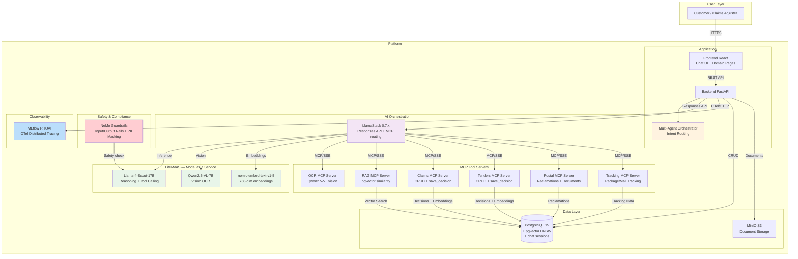

# Agentic Multi-Domain Decision Platform

An intelligent multi-agent decision platform powered by AI agents, demonstrating autonomous decision-making through **ReAct (Reasoning + Acting)** workflows with built-in compliance guardrails. The platform supports **multiple business domains** with a shared agent infrastructure and a **multi-agent orchestrator** that dynamically routes user requests to specialized domain agents:

- **Insurance Claims Processing** — Approve / Deny / Manual Review decisions
- **Tender Management (Appels d'Offres)** — Go / No-Go / Needs Deeper Review decisions for construction (BTP) tenders
- **Postal Mail Processing (Courrier)** — Complaint handling, package tracking, and knowledge base queries
- **Multi-Agent Orchestrator** — Intent-based routing, chat sessions, and cross-domain agent chaining

## Table of Contents

- [Business Overview](#business-overview)
- [Architecture](#architecture)
- [Backend Architecture](docs/backend-architecture.md) — Processing flows, modular design, and how to add a new agent
- [Technology Stack](#technology-stack)
- [Local Development](#local-development)
- [OpenShift Deployment](#openshift-deployment)
- [Configuration](#configuration)
- [NeMo Guardrails](#nemo-guardrails)
- [MLflow Tracing](#mlflow-tracing-opentelemetry)
- [Troubleshooting](#troubleshooting)
- [Known Issues](#known-issues)

---

## Business Overview

### What Problem Does This Solve?

Many business processes require expert analysis of documents, comparison with historical data, and structured decision-making — tasks that are time-consuming and prone to inconsistencies. This platform showcases how AI agents can **autonomously** process these tasks through intelligent reasoning and tool usage, while maintaining human oversight where needed.

### Use Case 1: Insurance Claims Processing

- Autonomous document processing via vision-based OCR (Qwen2.5-VL)
- Smart policy matching via semantic search through user contracts
- Precedent-based reasoning using similar historical claims (RAG)
- Decision: **Approve / Deny / Manual Review** with confidence score

### Use Case 2: Tender Management (Appels d'Offres)

- Ingests tender documents (DCE/RFP) and extracts key information via OCR
- Analyzes the tender against the company's past project references, certifications, and historical tender outcomes using RAG similarity search
- Generates a **Go / No-Go / Needs Deeper Review** recommendation with risk analysis, win probability, estimated margin, strengths and weaknesses
- Supports Human-in-the-Loop review when confidence is low

### Use Case 3: Postal Mail Processing (Courrier)

- Handles customer complaints (reclamations) related to postal services (lost packages, damaged mail, delivery delays)
- Tracks package and mail delivery status via the tracking MCP server
- Searches an internal postal knowledge base for regulations, procedures, and precedents
- Generates structured responses with resolution recommendations
- Three specialized sub-agents:
  - **courrier-reclamation**: Complaint CRUD, document management, decision saving
  - **courrier-suivi**: Real-time package/mail tracking
  - **courrier-info**: Knowledge base search for postal regulations

### The ReAct Agentic Workflow

Instead of rigid, pre-programmed rules, the system uses the **ReAct (Reasoning + Acting)** pattern where an AI agent reasons about what information it needs, calls appropriate tools, observes the results, and repeats until it can make a decision.

In practice, the agent calls **all 4 tools in a single parallel batch** for maximum efficiency:

```
Customer Submits Claim
        |
+-------------------------------------------------------+
|  ReAct Agent — Single-batch parallel tool calling      |
+-------------------------------------------------------+
|                                                        |
|  get_claim(claim_id)          -> Claim details         |
|  ocr_document(document_id)   -> Extracted text (OCR)   |
|  retrieve_user_info(user_id) -> Contracts & coverage   |
|  retrieve_similar_claims()   -> Historical precedents  |
|                                                        |
|  All 4 tools accept the claim number directly.         |
|  Auto-resolution removes inter-tool dependencies.      |
+-------------------------------------------------------+
        |
  Agent synthesizes all results
  -> Recommendation: Approve / Deny / Manual Review
  -> Confidence score + reasoning
        |
  save_claim_decision() -> Persists decision + embedding
```

### Multi-Agent Orchestrator

The platform includes a **multi-agent orchestrator** that classifies user intent via LLM and dispatches requests to the appropriate specialized agent:

```
User Message
    |
    v
+----------------------------------+
|     Multi-Agent Orchestrator     |
|     (Intent Classification)      |
+----------------------------------+
    |              |              |
    v              v              v
+---------+  +-----------+  +-----------+
| Claims  |  | Tenders   |  | Courrier  |
| Agent   |  | Agent     |  | Agent     |
+---------+  +-----------+  +-----------+
    |              |              |
    v              v              v
+--------------------------------------------------+
|              MCP Tool Servers                     |
| OCR | RAG | Claims | Tenders | Postal | Tracking |
+--------------------------------------------------+
    |                                    |
    v                                    v
+------------------------------+  +------------------+
|   S3/MinIO + PostgreSQL      |  | NeMo Guardrails  |
|   Documents + Decisions      |  | PII + Safety     |
+------------------------------+  +------------------+
    |
    v
+------------------------------+
|   MLflow RHOAI (OTel)        |
|   Distributed Tracing        |
+------------------------------+
```

**Key capabilities**:
- **SSE Streaming**: Real-time response streaming via `POST /chat/stream` with tool call events, text deltas, and completion notifications
- **Decision persistence**: Agents call `save_claim_decision` / `save_tender_decision` / `save_reclamation_decision` MCP tools to persist decisions, update status, and auto-generate embeddings
- **RAG by precedents**: Similar claims/tenders found via pgvector cosine similarity on OCR text embeddings
- **Intent-based routing**: Keyword classification routes user messages to the correct domain agent
- **Chat sessions**: Persistent conversation history with session management
- **Tool call observability**: Full tool execution traces (name, server, output, error) persisted and displayed in UI
- **Token consumption tracking**: Per-message and per-session LLM token usage displayed in chat
- **Bilingual support**: FR/EN language detection and response generation
- **NeMo Guardrails**: Input/output safety rails + PII masking via Presidio (PERSON, EMAIL, CREDIT_CARD, PHONE, SSN, IBAN)
- **MLflow tracing**: Distributed tracing via OpenTelemetry → MLflow RHOAI with full span hierarchy

### Compliance & Guardrails

#### NeMo Guardrails (TrustyAI)

The platform integrates **NeMo Guardrails** (GA in RHOAI 3.4) deployed via the TrustyAI operator for content safety and PII protection:

- **Input rails**: Self-check input flow — blocks harmful, abusive, or injection-style prompts before they reach the LLM
- **Output rails**: Self-check output flow — validates bot responses meet moderation policy (no PII leakage, no offensive content)
- **PII masking**: Presidio-based sensitive data detection on both input and output — automatically masks PERSON, EMAIL_ADDRESS, CREDIT_CARD, PHONE_NUMBER, US_SSN, and IBAN_CODE with `[REDACTED]` tokens
- **Configurable threshold**: PII detection score threshold configurable via `guardrails.pii.scoreThreshold` (default: 0.3)
- **Optional LLM detector**: LlamaGuard 3 1B can be enabled as an additional content safety detector (requires GPU)

NeMo is deployed as a standalone service via the TrustyAI operator (`NemoGuardrails` CRD). It does **not** proxy/encapsulate the LlamaStack — the backend calls NeMo explicitly for input validation before each LLM call in the chat flow. NeMo uses LiteMaaS directly (not LlamaStack) for its self-check prompts. If NeMo is unreachable (timeout 5s), the request is allowed through (fail-open).

#### PII Detection & Protection

- Automatic detection of emails, phone numbers, dates of birth, credit cards, SSN, IBAN during processing
- Real-time masking with `[REDACTED]` tokens without blocking workflow
- Complete audit trail for GDPR/CCPA compliance
- Dual-mode redaction: store both original + redacted versions, or redacted only (`pii_redaction_mode`)

#### Human-in-the-Loop (HITL) Review

For claims/tenders requiring manual review (low confidence, high-value, edge cases):
1. System shows AI recommendation with reasoning
2. Reviewer can ask clarifying questions to the agent
3. Reviewer makes final decision (approve/deny/request info)
4. System tracks both AI and human decisions for audit

---

## Architecture

### System Overview


```mermaid
graph TB
    subgraph "User Layer"
        U["Customer / Claims Adjuster"]
    end

    subgraph "Platform"
        subgraph "Application"
            F["Frontend React<br/>Chat UI + Domain Pages"]
            B["Backend FastAPI"]
            ORCH["Multi-Agent Orchestrator<br/>Intent Routing"]
        end

        subgraph "AI Orchestration"
            LS["LlamaStack 0.7.x<br/>Responses API + MCP routing"]
        end

        subgraph "Safety & Compliance"
            NEMO["NeMo Guardrails<br/>Input/Output Rails + PII Masking"]
        end

        subgraph "Observability"
            MLFLOW["MLflow RHOAI<br/>OTel Distributed Tracing"]
        end

        subgraph "LiteMaaS — Model as a Service"
            LLM["Llama-4-Scout-17B<br/>Reasoning + Tool Calling"]
            VIS["Qwen2.5-VL-7B<br/>Vision OCR"]
            EMB["nomic-embed-text-v1-5<br/>768-dim embeddings"]
        end

        subgraph "MCP Tool Servers"
            OCR["OCR MCP Server<br/>Qwen2.5-VL vision"]
            RAG["RAG MCP Server<br/>pgvector similarity"]
            CLAIMS_MCP["Claims MCP Server<br/>CRUD + save_decision"]
            TENDERS_MCP["Tenders MCP Server<br/>CRUD + save_decision"]
            POSTAL_MCP["Postal MCP Server<br/>Reclamations + Documents"]
            TRACKING_MCP["Tracking MCP Server<br/>Package/Mail Tracking"]
        end

        subgraph "Data Layer"
            DB[("PostgreSQL 15<br/>+ pgvector HNSW<br/>+ chat sessions")]
            S3["MinIO S3<br/>Document Storage"]
        end
    end

    U -->|HTTPS| F
    F -->|REST API| B
    B --> ORCH
    B -->|Responses API| LS
    B -->|OTel/OTLP| MLFLOW
    NEMO -->|Safety check| LLM
    LS -->|Inference| LLM
    LS -->|Vision| VIS
    LS -->|Embeddings| EMB
    LS -->|MCP/SSE| OCR
    LS -->|MCP/SSE| RAG
    LS -->|MCP/SSE| CLAIMS_MCP
    LS -->|MCP/SSE| TENDERS_MCP
    LS -->|MCP/SSE| POSTAL_MCP
    LS -->|MCP/SSE| TRACKING_MCP
    RAG -->|Vector Search| DB
    B -->|CRUD| DB
    B -->|Documents| S3
    CLAIMS_MCP -->|Decisions + Embeddings| DB
    TENDERS_MCP -->|Decisions + Embeddings| DB
    POSTAL_MCP -->|Reclamations| DB
    TRACKING_MCP -->|Tracking Data| DB

    style LS fill:#f3e5f5
    style NEMO fill:#ffcdd2
    style MLFLOW fill:#bbdefb
    style LLM fill:#e8f5e9
    style VIS fill:#e8f5e9
    style EMB fill:#e8f5e9
    style ORCH fill:#fff3e0
```

### Services Architecture

```
backend/
├── app/
│   ├── api/                          # Modular HTTP layer (sub-packages)
│   │   ├── shared/                   # Shared schemas & decision service
│   │   │   ├── schemas.py
│   │   │   └── decision_service.py
│   │   ├── claims/                   # Claims REST endpoints
│   │   │   ├── router.py
│   │   │   └── schemas.py
│   │   ├── tenders/                  # Tenders REST endpoints
│   │   │   ├── router.py
│   │   │   └── schemas.py
│   │   ├── postal/                   # Postal/reclamation REST endpoints
│   │   │   ├── router.py
│   │   │   └── schemas.py
│   │   ├── orchestrator/             # Multi-agent chat/orchestrator endpoints
│   │   │   ├── router.py
│   │   │   └── schemas.py
│   │   ├── hitl/                     # Human-in-the-Loop review endpoints
│   │   │   └── router.py
│   │   ├── documents/                # Document upload/download endpoints
│   │   │   └── router.py
│   │   ├── a2a/                      # Agent-to-Agent protocol endpoints
│   │   │   ├── router.py
│   │   │   └── schemas.py
│   │   └── admin/                    # Admin panel (database reset, stats)
│   │       └── router.py
│   ├── core/                         # Application core
│   │   ├── config.py                 # Settings from env vars (Pydantic)
│   │   ├── database.py               # SQLAlchemy async engine & session
│   │   └── tracing.py                # OpenTelemetry → MLflow OTLP exporter
│   ├── services/
│   │   ├── claim_service.py              # Claims orchestration
│   │   ├── tender_service.py             # Tenders orchestration
│   │   ├── reclamation_service.py        # Reclamations orchestration
│   │   ├── document_storage.py           # Document storage (MinIO/S3)
│   │   ├── agents/                       # Multi-agent layer
│   │   │   ├── base_agent_service.py     # Common agent pattern
│   │   │   ├── orchestrator_service.py   # Intent routing & chat sessions
│   │   │   ├── registry.py              # Dynamic agent registry
│   │   │   └── conversation_utils.py    # Chat conversation helpers
│   │   ├── agent/                        # Shared AI components
│   │   │   ├── responses_orchestrator.py # LlamaStack Responses API client
│   │   │   ├── response_parser.py        # Extract structured decisions
│   │   │   ├── context_builder.py        # Entity → markdown context formatter
│   │   │   └── reviewer.py              # HITL review logic
│   │   └── pii/                          # PII detection & redaction
│   │       ├── pii_service.py            # PII detection service
│   │       └── redactor.py               # Text redaction utilities
│   ├── models/                           # Database ORM
│   │   ├── claim.py                      # Claims model
│   │   ├── tender.py                     # Tenders model
│   │   ├── reclamation.py                # Reclamations model
│   │   └── conversation.py               # Chat conversations model
│   └── llamastack/                       # Prompts & integration config
│       ├── prompts.py                    # Claims agent prompts
│       ├── ao_prompts.py                 # Tender agent prompts
│       ├── courrier_prompts.py           # Courrier/postal agent prompts
│       └── orchestrator_prompts.py       # Multi-agent router prompts
├── mcp_servers/
│   ├── shared/               # Shared DB module (connection, retry, queries)
│   ├── ocr_server/           # Document OCR via Qwen2.5-VL vision model
│   ├── rag_server/           # Vector search (pgvector) + embedding generation
│   ├── claims_server/        # Claims CRUD + save_claim_decision + auto-embedding
│   ├── tenders_server/       # Tenders CRUD + save_tender_decision + auto-embedding
│   ├── postal_server/        # Reclamations CRUD + documents + decision saving
│   └── tracking_server/      # Package/mail tracking + postal knowledge base
├── scripts/
│   ├── init_data.py                      # Data initialization (download, upload, OCR, decisions)
│   ├── init_data/                        # Pre-defined decisions
│   ├── generate_claim_pdfs.py            # Generate claim PDF test data
│   ├── generate_tender_pdfs.py           # Generate tender PDF test data
│   ├── generate_reclamation_pdfs.py      # Generate reclamation PDF test data
│   ├── seed_database.py                  # Database seeding utility
│   └── upload_documents_to_llamastack.py # Upload PDFs to LlamaStack Files API
frontend/
├── src/
│   ├── pages/
│   │   ├── HomePage.tsx          # Dashboard with agent cards
│   │   ├── ChatPage.tsx          # Multi-agent chat interface
│   │   ├── ClaimsListPage.tsx    # Claims list with filters & search
│   │   ├── ClaimDetailPage.tsx   # Claim detail with processing steps
│   │   ├── TendersListPage.tsx   # Tenders list & filtering
│   │   ├── TenderDetailPage.tsx  # Tender detail with processing steps
│   │   ├── PostalListPage.tsx    # Postal reclamations list
│   │   ├── PostalDetailPage.tsx  # Reclamation detail with processing steps
│   │   └── AdminPage.tsx         # Admin panel (reset, stats)
│   ├── components/
│   │   ├── Layout.tsx            # App layout with navigation
│   │   ├── ReviewChatPanel.tsx   # HITL review chat panel (domain-agnostic)
│   │   ├── chat/                 # Chat UI
│   │   │   ├── AgentGraph.tsx        # Agent architecture visualization
│   │   │   ├── ChatMessage.tsx       # Message rendering with tool calls
│   │   │   ├── ChatWindow.tsx        # Chat window with SSE streaming
│   │   │   └── ToolCallSteps.tsx     # Tool call step display
│   │   ├── claim/                # Claims UI
│   │   │   ├── ClaimHeader.tsx       # Claim metadata display
│   │   │   ├── ClaimActions.tsx      # Process claim button
│   │   │   ├── ClaimDecision.tsx     # Decision rendering with badges
│   │   │   ├── ProcessingSteps.tsx   # Agent processing steps
│   │   │   ├── StepOutputDisplay.tsx # Expandable step output
│   │   │   └── GuardrailsAlert.tsx   # PII/guardrails alert display
│   │   ├── tender/               # Tenders UI
│   │   │   ├── TenderHeader.tsx      # Tender metadata display
│   │   │   ├── TenderActions.tsx     # Process tender button
│   │   │   ├── TenderDecision.tsx    # Go/No-Go decision rendering
│   │   │   └── TenderProcessingSteps.tsx # Tender processing steps
│   │   └── common/               # Shared components
│   │       ├── AgentCard.tsx          # Agent status card
│   │       └── PIIBadge.tsx           # PII detection badge
│   ├── hooks/
│   │   ├── useChat.ts            # Chat session management + SSE streaming
│   │   ├── useAgents.ts          # Agent registry hook
│   │   ├── useClaim.ts           # Claim data fetching
│   │   ├── useClaimPolling.ts    # Claim status polling
│   │   ├── useTender.ts          # Tender data fetching
│   │   ├── useTenderPolling.ts   # Tender status polling
│   │   ├── useReclamation.ts     # Reclamation data fetching
│   │   ├── useReclamationPolling.ts # Reclamation status polling
│   │   └── useToolDisplay.ts     # Tool call display formatting
│   ├── services/               # API clients
│   │   ├── api.ts                # Base axios instance
│   │   ├── claimService.ts       # Claims API client
│   │   ├── orchestratorService.ts # Orchestrator API client
│   │   ├── tenderApi.ts          # Tenders API client
│   │   ├── tenderService.ts      # Tender business logic
│   │   ├── postalApi.ts          # Postal API client
│   │   ├── postalService.ts      # Postal business logic
│   │   └── reviewService.ts      # HITL review API client
│   └── i18n/                     # Internationalization FR/EN
│       ├── LanguageContext.tsx    # React context for language state
│       └── translations.ts       # FR/EN translation strings
```

---

## Technology Stack

| Component | Technology | Details |
|-----------|-----------|---------|
| **LLM Inference** | LiteMaaS (Model as a Service) | Llama-4-Scout-17B (llama-scout-17b) |
| **Vision OCR** | Qwen2.5-VL-7B via LiteMaaS | PDF page images -> structured text extraction |
| **Embeddings** | nomic-embed-text-v1-5 via LiteMaaS | 768-dim vectors for similarity search |
| **AI Orchestration** | LlamaStack RHOAI 3.4 (llama-stack 0.7.x) | Responses API, MCP tool routing |
| **Guardrails** | NeMo Guardrails (TrustyAI operator) | Input/output safety rails + Presidio PII masking |
| **Tracing** | OpenTelemetry SDK → MLflow RHOAI | OTLP/HTTP distributed tracing with span hierarchy |
| **Backend** | Python 3.12 + FastAPI | REST API + SSE streaming |
| **Frontend** | React 18 + TypeScript + Tailwind | Chat UI + domain pages |
| **Database** | PostgreSQL 15 + pgvector (HNSW) | Claims, tenders, reclamations, vectors, chat sessions |
| **Document Storage** | MinIO S3-compatible | PDF documents for claims, tenders & reclamations |
| **MCP Servers** | FastMCP + SSE transport | OCR, RAG, Claims, Tenders, Postal, Tracking |
| **Deployment** | Helm 3.x on OpenShift 4.x | Or podman compose for local dev |

**Key architectural choice**: All AI models run as **remote Model-as-a-Service (MaaS)** through LiteMaaS endpoints. No local GPU required. The OCR server sends PDF page images to Qwen2.5-VL via the LlamaStack inference API, eliminating the need for heavy local OCR libraries.

---

## Local Development

### Quick Start with Podman Compose

```bash
# 1. Set your LiteMaaS credentials (required)
export LITEMAAS_URL=https://your-litemaas-llm-endpoint/v1
export LITEMAAS_API_KEY=sk-your-key
export LITEMAAS_EMBEDDING_URL=https://your-litemaas-embedding-endpoint/v1
export LITEMAAS_EMBEDDING_API_KEY=sk-your-key

# 2. Start all services
podman compose up --build
```

### What Gets Started

| Service | Port | Description |
|---------|------|-------------|
| PostgreSQL + pgvector | 5433 | Database with schema + seed data (30 claims, 30 tenders, 25 reclamations) |
| LlamaStack | 8321 | AI orchestration (Responses API, MCP tool routing) |
| Backend (FastAPI) | 8000 | REST API + SSE streaming + orchestrator |
| OCR MCP Server | 8081 | Vision-based OCR via Qwen2.5-VL |
| RAG MCP Server | 8082 | Vector search + embedding generation |
| Claims MCP Server | 8083 | Claims CRUD + decision persistence + auto-embedding |
| Tenders MCP Server | 8084 | Tenders CRUD + decision persistence + auto-embedding |
| Postal MCP Server | 8085 | Reclamations CRUD + documents + decision saving |
| Tracking MCP Server | 8086 | Package/mail tracking + postal knowledge base |
| MinIO | 9000/9001 | S3-compatible document storage |
| Frontend (React) | 3000 | Chat UI + domain pages |
| **data-init** | — | Downloads PDFs, uploads to LlamaStack, processes 10+10+10 items |

### Automatic Data Initialization

On first startup, the `data-init` service automatically:

1. **Downloads PDF documents** from the GitHub repository archive (31 claims + 31 tenders + 25 reclamations, each with FR + EN bilingual versions)
2. **Uploads PDFs to LlamaStack Files API** and updates `document_path` in database with file IDs (`file-xxx`)
3. **Processes 10 claims** via MCP tools: OCR (Qwen2.5-VL) + save_claim_decision (with embedding)
4. **Processes 10 tenders** via MCP tools: OCR + save_tender_decision (with embedding)
5. **Processes 10 reclamations** via MCP tools: OCR + save_reclamation_decision (with embedding)

After init completes, you'll have:
- 31 claims: 21 pending, 4 approved, 3 denied, 3 manual_review (with processing steps, OCR text, embeddings)
- 31 tenders: 21 pending, 4 go, 3 no_go, 3 needs_deeper_review
- 25 reclamations: 15 pending, 10 processed with decisions

The init is **idempotent** — it checks if `document_path` already contains file IDs before running. PDF documents live in the `documents/` directory of the repository, never inside Docker images.

### Force Re-initialization (FORCE_REINIT)

If you need to re-ingest PDFs (e.g., after regenerating documents or updating seed data), set `FORCE_REINIT=true`. This resets the database state without requiring a full DB wipe:

```bash
# Local (podman compose)
FORCE_REINIT=true podman compose up data-init

# OpenShift (via Helm)
helm upgrade multi-agents helm/multi-agents \
  --set dataInit.forceReinit=true \
  -n multi-agent
```

**What FORCE_REINIT does:**
1. Resets `claims.document_path` to original filenames (rebuilt from `claim_type`)
2. Resets `tenders.document_path` to original filenames (rebuilt from `tender_number`)
3. Sets `status = 'pending'`, clears `processed_at` and `total_processing_time_ms`
4. Deletes all `claim_documents`, `claim_decisions`, `processing_logs`
5. Deletes all `tender_documents`, `tender_decisions`
6. Then continues with the normal init flow (download, upload, OCR, decisions)

> **Note**: After re-init, remember to set `forceReinit` back to `"false"` to avoid re-processing on every upgrade.

### Access

- **Frontend**: http://localhost:3000
- **Backend API**: http://localhost:8000/api/v1
- **MinIO Console**: http://localhost:9001

### Development Notes

- `docker-compose.yml` is the git-tracked version with placeholder values
- Set LiteMaaS credentials via environment variables or a `.env` file
- Backend has hot-reload enabled (app code mounted as volume)
- Frontend has hot-reload via Vite dev server
- MCP servers require a rebuild to pick up code changes: `podman compose up --build <service>`

### Resetting Data

```bash
# Remove volumes and restart
podman compose down -v
podman compose up --build
```

---

## OpenShift Deployment

### Prerequisites

1. **OpenShift 4.x** with Helm 3.12+
2. **RHOAI 3.4** with TrustyAI operator (for NeMo Guardrails) and MLflow (for tracing)
3. **LiteMaaS endpoints** for LLM inference, vision OCR, and embeddings (no local GPU needed)
4. **Container registry** access (Quay.io, Docker Hub, or internal)

### Deploy

All sensitive values and cluster-specific settings are passed via `--set` flags (never committed to git).

```bash
helm install multi-agents helm/multi-agents \
  -n <NAMESPACE> --create-namespace --timeout 10m \
  --set global.namespace=<NAMESPACE> \
  --set global.clusterDomain="<CLUSTER_DOMAIN>" \
  --set llamastack.litemaas.url="<LITEMAAS_LLM_URL>" \
  --set llamastack.litemaas.embeddingUrl="<LITEMAAS_EMBEDDING_URL>" \
  --set llamastack.litemaas.visionUrl="<LITEMAAS_VISION_URL>" \
  --set secrets.litemaasApiKey="<LITEMAAS_API_KEY>" \
  --set secrets.litemaasEmbeddingApiKey="<LITEMAAS_EMBEDDING_API_KEY>" \
  --set secrets.litemaasVisionApiKey="<LITEMAAS_VISION_API_KEY>" \
  --set secrets.postgresPassword="<DB_PASSWORD>" \
  --set secrets.postgresAdminPassword="<DB_ADMIN_PASSWORD>" \
  --set secrets.llamastackPassword="<LLAMASTACK_DB_PASSWORD>" \
  --set mlflow.enabled=true \
  --set mlflow.workspace=<NAMESPACE>
```

**Parameters:**

| Parameter | Description | Example |
|-----------|-------------|---------|
| `global.namespace` | Target namespace (must match `-n` flag) | `multi-agent` |
| `global.clusterDomain` | OpenShift apps domain | `apps.cluster-xxx.sandbox.opentlc.com` |
| `llamastack.litemaas.url` | LLM inference endpoint | `https://litellm-prod.apps.maas.example.com/v1` |
| `llamastack.litemaas.embeddingUrl` | Embedding endpoint | Same or different from LLM URL |
| `llamastack.litemaas.visionUrl` | Vision model endpoint (OCR) | `https://litellm-vision.apps.example.com/v1` |
| `secrets.litemaas*ApiKey` | API keys for each MaaS endpoint | `sk-...` |
| `secrets.postgres*Password` | Database passwords | Any strong password |
| `mlflow.enabled` | Enable tracing + auto-create RBAC | `true` |
| `mlflow.workspace` | RHOAI workspace (namespace) | Same as namespace |
| `guardrails.enabled` | Enable NeMo Guardrails | `true` (default) |

### Multi-namespace deployment

Deploy multiple independent instances on the same cluster by changing the namespace:

```bash
# Instance 1
helm install multi-agents helm/multi-agents \
  -n multi-agent --create-namespace --timeout 10m \
  --set global.namespace=multi-agent \
  --set global.clusterDomain="apps.cluster-xxx.sandbox.opentlc.com" \
  --set llamastack.litemaas.url="..." \
  --set secrets.litemaasApiKey="..." \
  --set secrets.postgresPassword="..." \
  ...

# Instance 2 (different namespace, can use different API keys)
helm install multi-agents helm/multi-agents \
  -n test-multi-agent --create-namespace --timeout 10m \
  --set global.namespace=test-multi-agent \
  ...
```

Each instance gets its own PostgreSQL, MinIO, LlamaStack, MCP servers, NeMo Guardrails, and routes. The only shared resources are the LiteMaaS endpoints (external) and the container registry.

### RHOAI 3.4 / LlamaStack 0.7.x compatibility

The Helm chart is compatible with **RHOAI 3.4** which ships **llama-stack 0.7.1+rhaiv.1**. Key changes from RHOAI 3.3:

| Change | RHOAI 3.3 (llama-stack 0.4.x) | RHOAI 3.4 (llama-stack 0.7.x) |
|--------|-------------------------------|-------------------------------|
| Agent API | `agents` API | `responses` API |
| Provider type | `inline::meta-reference` | `inline::builtin` |
| Provider config key | `agents` | `responses` |
| Guardrails | TrustyAI FMS (`remote::trustyai_fms`) | NeMo Guardrails (TrustyAI operator) |
| Tracing | MLflow Python SDK | OpenTelemetry SDK → MLflow OTLP |
| ConfigMap key | `config.yaml` | `config.yaml` (unchanged) |
| vLLM provider URL | `base_url` | `base_url` (unchanged) |

The LlamaStack configmap (`templates/llamastack/configmap.yaml`) handles all of these automatically. LiteMaaS URLs are injected via Helm template values, while secrets (API keys, DB passwords) use `${env.XXX}` variable substitution from the LlamaStackDistribution CRD environment variables.

**Important**: The embedding `provider_model_id` must match the model name registered on the LiteLLM proxy exactly (e.g., `nomic-embed-text-v1-5` with hyphens, not `nomic-embed-text-v1.5` with dots). This is configurable via `llamastack.embedding.providerModelId` in values.

### Quick start (after cloning)

```bash
git clone https://github.com/mouachan/multi-agents.git
cd multi-agents

helm install multi-agents helm/multi-agents \
  -n <NAMESPACE> --create-namespace --timeout 10m \
  --set global.namespace=<NAMESPACE> \
  --set global.clusterDomain="<CLUSTER_DOMAIN>" \
  --set llamastack.litemaas.url="<LITEMAAS_LLM_URL>" \
  --set llamastack.litemaas.embeddingUrl="<LITEMAAS_EMBEDDING_URL>" \
  --set llamastack.litemaas.visionUrl="<LITEMAAS_VISION_URL>" \
  --set secrets.litemaasApiKey="<LITEMAAS_API_KEY>" \
  --set secrets.litemaasEmbeddingApiKey="<LITEMAAS_EMBEDDING_API_KEY>" \
  --set secrets.litemaasVisionApiKey="<LITEMAAS_VISION_API_KEY>" \
  --set secrets.postgresPassword="<DB_PASSWORD>" \
  --set secrets.postgresAdminPassword="<DB_ADMIN_PASSWORD>" \
  --set secrets.llamastackPassword="<LLAMASTACK_DB_PASSWORD>" \
  --set mlflow.enabled=true \
  --set mlflow.workspace=<NAMESPACE>

# Wait ~5 min for all pods to be ready, then access:
echo "Frontend: https://frontend-<NAMESPACE>.<CLUSTER_DOMAIN>"
```

### Verify

```bash
oc get pods -n <NAMESPACE>
oc get routes -n <NAMESPACE>

# Check data initialization completed
oc logs -l job-name -n <NAMESPACE>

# Verify file IDs in database
oc exec postgresql-0 -n <NAMESPACE> -- \
  psql -U multi_agent_user -d multi_agent_db -c \
  "SELECT claim_number, document_path FROM claims WHERE document_path LIKE 'file-%' LIMIT 5;"

# Verify embeddings
oc exec postgresql-0 -n <NAMESPACE> -- \
  psql -U multi_agent_user -d multi_agent_db -c \
  "SELECT COUNT(*) FROM claim_documents WHERE embedding IS NOT NULL;"

# Check NeMo Guardrails
oc get nemoguardrails -n <NAMESPACE>

# Check MLflow traces
oc logs deployment/backend -n <NAMESPACE> | grep -i "trace exported"
```

### Access

```bash
echo "Frontend: https://$(oc get route frontend -n <NAMESPACE> -o jsonpath='{.spec.host}')"
echo "Backend:  https://$(oc get route backend -n <NAMESPACE> -o jsonpath='{.spec.host}')/api/v1"
```

---

## Configuration

### LiteMaaS Models

Models are configured via Helm values (OpenShift) or environment variables (local):

| Model | Role | Provider |
|-------|------|----------|
| `litemaas/llama-scout-17b` | Default LLM (reasoning + tool calling) | LiteMaaS |
| `litemaas-vision/Qwen2.5-VL-7B-Instruct` | Vision OCR (PDF page images) | LiteMaaS |
| `litemaas/nomic-embed-text-v1-5` | Embeddings (768-dim) | LiteMaaS |

> **Note**: LLM, vision, and embedding models can point to different LiteMaaS endpoints. In the LlamaStack config, each model is registered under its own provider (`litemaas`, `litemaas-vision`), each with its own `base_url` and `api_token`. This allows mixing endpoints — e.g., LLM on one endpoint, vision on another.

Model IDs are fully configurable via Helm values:

```yaml
llamastack:
  litemaas:
    url: "https://your-litemaas-llm-endpoint/v1"
    embeddingUrl: "https://your-litemaas-embedding-endpoint/v1"
    visionUrl: "https://your-litemaas-vision-endpoint/v1"
    defaultModel: "litemaas/llama-scout-17b"
    embeddingModel: "litemaas/nomic-embed-text-v1-5"
    visionModel: "litemaas-vision/Qwen2.5-VL-7B-Instruct"
  embedding:
    dimension: 768
    providerModelId: "nomic-embed-text-v1-5"  # Must match LiteLLM proxy model name exactly
  vision:
    providerModelId: "Qwen2.5-VL-7B-Instruct"
```

### Agent Prompts

Prompts are defined in `backend/app/llamastack/prompts.py` (claims), `ao_prompts.py` (tenders), and `courrier_prompts.py` (postal/courrier). On OpenShift, they are overridden via ConfigMap-mounted files at `/app/prompts/`, `/app/prompts-ao/`, and `/app/prompts-courrier/`. Both sources must be kept in sync.

Each agent prompt distinguishes between **information queries** (detail, list, show) that call only CRUD tools, and **processing requests** (process, traiter, evaluate) that trigger the full workflow (OCR + RAG + decision).

### Backend Environment Variables

```yaml
# LlamaStack
LLAMASTACK_ENDPOINT: http://llamastack:8321
LLAMASTACK_DEFAULT_MODEL: litemaas/llama-scout-17b
LLAMASTACK_EMBEDDING_MODEL: nomic-embed-text

# MCP Servers
OCR_SERVER_URL: http://ocr-server:8080
RAG_SERVER_URL: http://rag-server:8080
CLAIMS_SERVER_URL: http://claims-server:8080
TENDERS_SERVER_URL: http://tenders-server:8080
POSTAL_SERVER_URL: http://postal-server:8080
TRACKING_SERVER_URL: http://tracking-server:8080

# NeMo Guardrails (optional)
GUARDRAILS_SERVER_URL: http://claims-guardrails:80
GUARDRAILS_MODEL_NAME: llama-scout-17b  # must match LiteMaaS model name, NOT the NeMo config ID

# MLflow Tracing (optional — disabled when empty)
MLFLOW_TRACKING_URI: https://mlflow.redhat-ods-applications.svc.cluster.local:8443
MLFLOW_EXPERIMENT_NAME: multi-agent-orchestrator
MLFLOW_RHOAI_WORKSPACE: multi-agent

# PII Detection
ENABLE_PII_DETECTION: "true"
PII_REDACTION_MODE: "dual"  # "dual" = original + redacted, "redact_only" = redacted only

# S3/MinIO
S3_ENDPOINT_URL: http://minio:9000
S3_ACCESS_KEY_ID: admin
S3_SECRET_ACCESS_KEY: ***

# Database
POSTGRES_HOST: postgresql
POSTGRES_PORT: 5432
POSTGRES_DATABASE: multi_agent_db
POSTGRES_USER: multi_agent_user
POSTGRES_PASSWORD: ***
```

### Frontend Configuration

Frontend uses nginx reverse proxy — no environment variables needed. API calls go to `/api/v1/...` (relative path), nginx routes to backend.

---

## NeMo Guardrails

### Architecture

NeMo Guardrails is deployed via the **TrustyAI operator** as a `NemoGuardrails` CRD. It runs as a **standalone service** — the backend calls it explicitly for input validation before each LLM call. NeMo does NOT proxy/encapsulate LlamaStack.

```
User Input
    |
    v
+---------------------------+       +---------------------------+
|    Backend Orchestrator   |       |    NeMo Guardrails        |
|                           |       |  ┌─────────────────────┐  |
|  1. Check input ─────────────────>│  Input Rails          │  |
|     POST /v1/guardrail/   |       |  │  - self check input │  |
|           checks          |<──────│  │  - mask PII (input) │  |
|                           |       |  └─────────────────────┘  |
|  2. If blocked → refuse   |       +---------------------------+
|     If allowed ↓          |
|                           |       +---------------------------+
|  3. Call LlamaStack ─────────────>|    LlamaStack             |
|     POST /v1/responses    |<──────|    (Responses API)        |
|                           |       +---------------------------+
|  4. PII redaction (local) |
|     regex-based masking   |
+---------------------------+
    |
    v
Bot Response (safe, PII-redacted)
```

**Important**: The `model` field in NeMo API calls must be the actual LLM model name (e.g. `llama-scout-17b`), not the config ID. NeMo uses this model for self-check prompts via LiteMaaS. The NeMo service listens on port **80** (not 8000/8080). The guardrail check endpoint is `/v1/guardrail/checks` (singular, not `/v1/guardrails/checks`).

### Rails Configuration

**Input rails**:
- `self check input` — LLM-based prompt that checks if user input is harmful, abusive, or attempts injection attacks
- `mask sensitive data on input` — Presidio-based PII detection and masking on incoming text

**Output rails**:
- `self check output` — LLM-based prompt that validates bot response meets moderation policy
- `mask sensitive data on output` — Presidio-based PII masking on outgoing text

### PII Entities Detected

| Entity | Example |
|--------|---------|
| PERSON | "Jean Dupont" → `[REDACTED]` |
| EMAIL_ADDRESS | "jean@email.com" → `[REDACTED]` |
| CREDIT_CARD | "4111-1111-1111-1111" → `[REDACTED]` |
| PHONE_NUMBER | "+33 6 12 34 56 78" → `[REDACTED]` |
| US_SSN | "123-45-6789" → `[REDACTED]` |
| IBAN_CODE | "FR76 3000 6000..." → `[REDACTED]` |

### Helm Parameters

| Parameter | Description | Default |
|-----------|-------------|---------|
| `guardrails.enabled` | Deploy NeMo Guardrails | `true` |
| `guardrails.name` | NemoGuardrails CR name | `claims-guardrails` |
| `guardrails.replicas` | Number of replicas | `1` |
| `guardrails.pii.scoreThreshold` | Presidio detection confidence threshold | `0.3` |
| `guardrails.llamaGuard.enabled` | Deploy LlamaGuard 3 1B detector (requires GPU) | `false` |

### Helm Templates

- `templates/guardrails/nemoguardrails.yaml` — `NemoGuardrails` CRD (TrustyAI operator)
- `templates/guardrails/nemo-configmap.yaml` — NeMo config (models, rails, prompts, PII entities)
- `templates/guardrails/detector-inferenceservice.yaml` — Optional LlamaGuard InferenceService (GPU)

---

## MLflow Tracing (OpenTelemetry)

The backend supports distributed tracing via **OpenTelemetry** with traces exported to **MLflow RHOAI** (GenAI apps & agents tab). Tracing is optional — disabled by default, activated when `MLFLOW_TRACKING_URI` is set.

**How it works**: The backend uses the OpenTelemetry SDK with an OTLP/HTTP exporter that sends traces to MLflow's `/v1/traces` endpoint. Each agent call produces a trace with spans for the orchestrator, agent, tool calls, and LLM response. Authentication uses the pod's ServiceAccount token, TLS uses OpenShift's `service-ca.crt`.

**Span hierarchy** (visible in MLflow "GenAI apps & agents"):

```
{agent_id} | {message}       (root)
└── agent-{agent_id}         (agent span)
    ├── tool:{tool_name}     (one span per MCP tool call)
    └── llm-response         (LLM inference span)
```

Each span includes: `response.id`, input/output text, tool call details, token usage, and agent decision metadata.

**Enable via Helm**:

```bash
helm upgrade multi-agents helm/multi-agents \
  --set mlflow.enabled=true \
  --set mlflow.workspace=<NAMESPACE>
```

**Helm parameters**:

| Parameter | Description | Default |
|-----------|-------------|---------|
| `mlflow.enabled` | Enable tracing + auto-create RBAC RoleBinding | `false` |
| `mlflow.trackingUri` | MLflow RHOAI internal URL | `https://mlflow.redhat-ods-applications.svc.cluster.local:8443` |
| `mlflow.experimentName` | MLflow experiment name | `multi-agent-orchestrator` |
| `mlflow.workspace` | RHOAI workspace (namespace) | `""` |

**RBAC (RHOAI 3.4)**: The Helm chart automatically creates a RoleBinding for the `mlflow-operator-mlflow-integration` ClusterRole when `mlflow.enabled=true`. This grants the backend's ServiceAccount access to MLflow pseudo-resources (`experiments`, `datasets`, `registeredmodels`) in the `mlflow.kubeflow.org` API group. Without this, trace exports fail with `403 Forbidden`.

**Experiment creation**: The backend auto-resolves the experiment ID at startup with retry logic (5 attempts, 3s delay). If the experiment doesn't exist, the backend **auto-creates it**. If MLflow is unreachable after all retries, tracing is disabled gracefully.

**Graceful shutdown**: The backend flushes all pending OTel spans on shutdown via `TracerProvider.force_flush()` to avoid trace loss from the `BatchSpanProcessor` buffer.

**Reusability**: When agents are separated into individual services, each service only needs `opentelemetry-sdk` + `opentelemetry-exporter-otlp-proto-http` packages and the same env vars (`MLFLOW_TRACKING_URI`, `MLFLOW_EXPERIMENT_NAME`, `MLFLOW_RHOAI_WORKSPACE`). No MLflow SDK or custom code required — OTel context propagation handles cross-service trace correlation automatically.

**Local development**: Set `MLFLOW_TRACKING_URI` in your `.env` file to point to your MLflow instance. Without it, tracing is silently disabled.

---

## Testing the Application

### Via Web UI

1. **Claims List**: Navigate to Claims page. See all 30 claims with status, filters, search. 10 already processed with status badges.

2. **Process a Pending Claim**: Click "View Details" on a pending claim, then "Process Claim". The agent calls all 4 tools in parallel and returns a decision in ~10-15 seconds.

3. **View Processing Steps**: After processing, see all tool executions (OCR, User Info, Similar Claims, Decision) with expandable output for each step.

4. **Chat Interface**: Use the multi-agent chat to process claims or tenders conversationally. The orchestrator routes to the correct agent. SSE streaming shows tool calls in real-time.

5. **Tenders**: Same workflow for construction tenders — Go/No-Go/Needs Deeper Review decisions.

6. **Guardrails**: PII detected during processing is flagged with a `GuardrailsAlert` badge. Try sending a prompt injection in the chat — NeMo blocks it.

### Via API

```bash
BACKEND=http://localhost:8000

# List claims
curl "$BACKEND/api/v1/claims?status=pending" | jq

# Process a claim
CLAIM_ID="<uuid-from-list>"
curl -X POST "$BACKEND/api/v1/claims/$CLAIM_ID/process" \
  -H "Content-Type: application/json" \
  -d '{"skip_ocr": false, "enable_rag": true}'

# Get decision
curl "$BACKEND/api/v1/claims/$CLAIM_ID/decision" | jq

# Chat (SSE streaming)
curl -N -X POST "$BACKEND/api/v1/orchestrator/chat/stream" \
  -H "Content-Type: application/json" \
  -d '{"message": "Analyse le sinistre CLM-2024-0015", "session_id": null}'
```

---

## Troubleshooting

### LlamaStack Cannot Connect to LiteMaaS

**Check**:
```bash
# Verify LlamaStack health
curl http://localhost:8321/v1/health

# Check LlamaStack logs for model connection errors
podman logs multi-agents-llamastack

# On OpenShift
oc logs -l app=llama-stack -n <NAMESPACE>
```

**Solution**: Verify `LITEMAAS_URL` and `LITEMAAS_API_KEY` environment variables are set correctly.

### LlamaStack CrashLoopBackOff on RHOAI 3.4

Common causes and fixes:

1. **"Could not resolve config"** — The configmap key must be `config.yaml`. The RHOAI operator mounts the configmap at `/etc/llama-stack/` and the entrypoint expects `config.yaml`.

2. **"You must provide a URL in config.yaml"** — llama-stack 0.7.x uses `base_url` in the vLLM provider config. Check `templates/llamastack/configmap.yaml`.

3. **"Object already exists"** — Model already registered in PostgreSQL kvstore from a previous run. Clean up:
   ```bash
   oc exec postgresql-0 -n <NAMESPACE> -- \
     psql -U multi_agent_user -d multi_agent_db -c \
     "DELETE FROM llamastack_kvstore WHERE key LIKE '%model%';"
   ```
   Then restart the LlamaStack pod.

4. **Embedding 401/403 errors** — The `provider_model_id` must match the LiteLLM proxy model name exactly (e.g., `nomic-embed-text-v1-5` with hyphens, not `nomic-embed-text-v1.5` with dots). Check your LiteLLM proxy's `/models` endpoint to confirm the exact model name.

### RAG Returns No Similar Claims

**Check**:
```bash
# Verify embeddings exist
oc exec postgresql-0 -n <NAMESPACE> -- \
  psql -U multi_agent_user -d multi_agent_db -c \
  "SELECT COUNT(*) FROM claim_documents WHERE embedding IS NOT NULL;"
```

**Solution**: Ensure `data-init` service completed successfully. Embeddings are auto-generated when saving decisions via MCP tools.

### OCR Fails or Times Out

The OCR server sends PDF page images to Qwen2.5-VL via LlamaStack. If it fails:
- Check LlamaStack logs for inference errors
- Verify the vision model `litemaas-vision/Qwen2.5-VL-7B-Instruct` is accessible
- Each page takes ~5-10 seconds, multi-page documents take longer

### NeMo Guardrails Not Working

```bash
# Check NemoGuardrails CR status
oc get nemoguardrails -n <NAMESPACE>

# Check guardrails pod logs
oc logs -l app=claims-guardrails -n <NAMESPACE>

# Verify ConfigMap is mounted
oc describe nemoguardrails claims-guardrails -n <NAMESPACE>
```

Common issues:
- **LiteMaaS 401**: The `model` field in NeMo API calls must be the LLM model name (e.g. `llama-scout-17b`), NOT the NeMo config ID (`claims-guardrails`). NeMo passes this model name to LiteMaaS — if it doesn't match an allowed model, LiteMaaS returns 401.
- **Wrong port**: NeMo service listens on port **80** (service port) → targetPort 8000. Use `http://claims-guardrails:80`, not `:8000` or `:8080`.
- **Wrong endpoint**: The guardrail check endpoint is `/v1/guardrail/checks` (singular), not `/v1/guardrails/checks` (plural).
- **Pod not starting**: TrustyAI operator must be installed (`oc get csv -n redhat-ods-applications | grep trustyai`)

### MLflow Traces Not Appearing

```bash
# Check backend logs for trace export
oc logs deployment/backend -n <NAMESPACE> | grep -i "mlflow\|otlp\|trace"

# Verify RBAC
oc get rolebinding mlflow-backend-integration -n <NAMESPACE>

# Verify experiment exists
SA_TOKEN=$(oc create token default -n <NAMESPACE>)
curl -k -H "Authorization: Bearer $SA_TOKEN" \
  -H "x-]mlflow-workspace: <NAMESPACE>" \
  "https://mlflow.redhat-ods-applications.svc.cluster.local:8443/api/2.0/mlflow/experiments/list"
```

Common issues:
- **403 Forbidden**: Missing `mlflow-operator-mlflow-integration` RoleBinding — set `mlflow.enabled=true` in Helm values
- **RESOURCE_DOES_NOT_EXIST**: Experiment not created — the backend auto-creates it at startup, but if that fails check LiteMaaS/MLflow connectivity
- **Connection refused at startup**: MLflow not ready when backend starts — the retry logic (5 attempts, 3s delay) handles this automatically. Check logs for `Resolved experiment → ID X`
- **Traces lost on shutdown**: Fixed — the backend now calls `TracerProvider.force_flush()` before exit

### Data Init Service Fails

```bash
podman logs multi-agents-data-init
```

Common causes: LlamaStack not healthy yet (increase retry timeout), MCP servers not started.

---

## Known Issues

### ReAct Streaming Intermediate Steps

- **Status**: Intermediate reasoning steps (thoughts between tool calls) not stored
- **Cause**: LlamaStack bug — requires upstream fix for streaming persistence
- **Workaround**: Check LlamaStack pod logs for full trace

### Current Version: v3.4

**What's new in v3.4**:
- **RHOAI 3.4 / llama-stack 0.7.x compatibility**: Full migration from llama-stack 0.4.x (RHOAI 3.3) to 0.7.1 (RHOAI 3.4)
- **Responses API**: Replaced deprecated `agents` API with `responses` API — new `inline::builtin` provider replaces `inline::meta-reference`
- **NeMo Guardrails**: Replaced TrustyAI FMS guardrails (`remote::trustyai_fms`) with NeMo Guardrails (GA in RHOAI 3.4) — input/output safety rails + PII masking via Presidio
- **Guardrails input check in chat**: NeMo now validates user input in the orchestrator chat flow (both sync and streaming) before calling the LLM. Blocked messages return a localized refusal (FR/EN). Fail-open with 5s timeout.
- **MLflow RBAC**: Helm chart auto-creates `mlflow-operator-mlflow-integration` RoleBinding for trace export access to MLflow pseudo-resources (`mlflow.kubeflow.org` API group)
- **Resilient tracing**: Experiment ID resolution with retry logic (5 attempts, 3s delay), auto-create experiment if missing, graceful flush on shutdown
- **Enhanced tracing**: `response.id` and agent decision metadata (decision, recommendation, entity info) added to OTel spans
- **Harmonized truncation**: All trace output fields truncated at 2000 chars (was 500)
- **All images bumped to v3.4**: backend, frontend, data-init, and all 6 MCP servers

**What was in v3.3** (backend only):
- **OpenTelemetry tracing**: Replaced MLflow Python SDK with OpenTelemetry SDK + OTLP/HTTP exporter for distributed tracing
- **Reusable tracing architecture**: Each future separated agent only needs OTel SDK + env vars — no MLflow-specific code required
- **Removed MLflow SDK dependency**: `mlflow[auth]` replaced by lightweight `opentelemetry-sdk` + `opentelemetry-exporter-otlp-proto-http`
- **Removed MLflow workspace plugin**: `mlflow_rhoai_workspace.py` no longer needed — workspace header injected directly in OTLP headers

**What was in v3**:
- **Postal/Courrier domain**: New business domain for postal mail processing — complaint handling (reclamations), package tracking, and postal knowledge base queries
- **2 new MCP servers**: `postal-server` (reclamations CRUD, documents, decision saving) and `tracking-server` (package/mail tracking, postal knowledge base search)
- **3 courrier sub-agents**: `courrier-reclamation`, `courrier-suivi`, `courrier-info` — each with specialized prompts and tool routing
- **Bilingual PDF documents**: All claims, tenders, and reclamation PDFs now have French (FR) and English (EN) versions
- **25 reclamation seed data**: Database seeded with 25 postal reclamations across multiple categories (lost packages, damaged mail, delivery delays, etc.)
- **Backend API refactoring**: API routes split from monolithic files into modular sub-packages (`api/claims/`, `api/tenders/`, `api/postal/`, `api/hitl/`, etc.)
- **Reclamation model**: New `reclamation` database model with full CRUD, processing pipeline, and decision persistence
- **Helm chart**: Added `mcp.postal` and `mcp.tracking` sections, LlamaStack tool_groups for postal/tracking, courrier-prompts ConfigMap
- **Token usage metadata**: Decision metadata now includes `tokens_used` tracking
- **All images bumped to v3**: backend, frontend, data-init, ocr-server, rag-server, claims-server, tenders-server, postal-server, tracking-server

**What was in v2.1** (backend v2.1, frontend v2.3):
- **HITL domain-agnostic**: Human-in-the-Loop review now works for both claims AND tenders (was claims-only). Uses the existing `AgentRegistry` with HITL metadata — zero new files
- **Tender processing fix**: All 5 MCP tools (`get_tender`, `ocr_document`, `retrieve_similar_references`, `retrieve_historical_tenders`, `retrieve_capabilities`) are now called correctly in a single batch
- **`ReviewChatPanel` generic**: Frontend review panel accepts `entityType`/`entityId` props, works for any domain

**What was in v2.0**:
- Switched default LLM to `llama-scout-17b` (Llama-4-Scout-17B)
- Multi-provider LlamaStack config: LLM, vision, and embedding can each point to different endpoints
- Fixed RAG server health check — no longer calls embedding API on every K8s probe
- Fixed embedding model name mismatch (`nomic-embed-text-v1-5` with hyphens, not dots)

**What was in v1.0**:
- RHOAI 3.3 / llama-stack 0.4.x compatibility (`base_url`, `config.yaml` key, dynamic model IDs)
- Multi-namespace Helm deployment support
- Route timeout 300s on frontend and backend
- Configurable embedding model ID and dimension via Helm values

**Working**:
- End-to-end claim processing via multi-agent chat (4 parallel tool calls)
- End-to-end tender / Appels d'Offres processing via multi-agent chat (5 parallel tool calls)
- End-to-end postal/reclamation processing via multi-agent chat
- SSE streaming responses (real-time tool calls + text deltas)
- Vision-based OCR via Qwen2.5-VL (replaces EasyOCR)
- RAG by precedents: similar claims/tenders via pgvector HNSW cosine similarity
- Auto-embedding generation on decision save (no separate pipeline)
- Automatic data initialization (87+ bilingual PDFs from GitHub archive, 30 processed items with OCR + decisions + embeddings)
- Decision persistence via MCP tools (save_claim_decision, save_tender_decision, save_reclamation_decision)
- Postal/courrier domain: complaint handling, package tracking, knowledge base queries
- NeMo Guardrails: input/output safety rails + Presidio PII masking (PERSON, EMAIL, CREDIT_CARD, PHONE, SSN, IBAN)
- MLflow distributed tracing via OpenTelemetry (orchestrator → agent → tool span hierarchy)
- S3/MinIO document storage
- PII detection & redaction with audit trail
- HITL review workflow — domain-agnostic for claims & tenders (ask agent, approve, reject, request info)
- Multi-agent orchestrator with intent-based routing
- Chat sessions with persistent message history
- Tool call observability (collapsible traces with output/error per tool)
- Token consumption tracking (per-message and per-session)
- Bilingual support FR/EN
- Local development with podman compose
- Helm deployment on OpenShift (RHOAI 3.4 / llama-stack 0.7.x compatible)

### Image Versions

| Component | Image | Version |
|-----------|-------|---------|
| Backend | `quay.io/mouachan/multi-agents/backend` | **v3.4** |
| Frontend | `quay.io/mouachan/multi-agents/frontend` | **v3.4** |
| Claims MCP Server | `quay.io/mouachan/multi-agents/claims-server` | **v3.4** |
| Tenders MCP Server | `quay.io/mouachan/multi-agents/tenders-server` | **v3.4** |
| OCR MCP Server | `quay.io/mouachan/multi-agents/ocr-server` | **v3.4** |
| RAG MCP Server | `quay.io/mouachan/multi-agents/rag-server` | **v3.4** |
| Postal MCP Server | `quay.io/mouachan/multi-agents/postal-server` | **v3.4** |
| Tracking MCP Server | `quay.io/mouachan/multi-agents/tracking-server` | **v3.4** |
| Data Init Job | `quay.io/mouachan/multi-agents/data-init` | **v3.4** |

**In Progress**:
- OpenShift OAuth authentication
